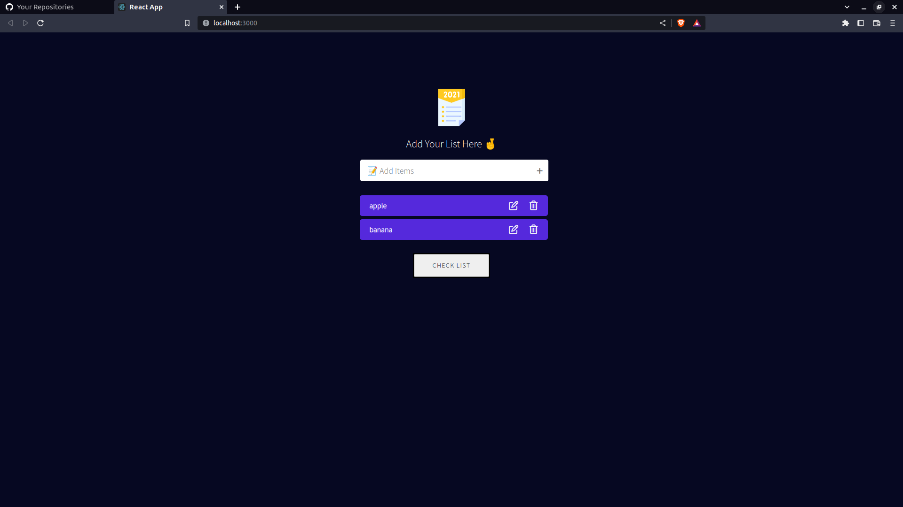

# TODO-App | React.js

By Prince Kr Paswan

## [Link to the TODO-App](https://-prince.netlify.app/)

## How it will help you?

It helps you to maintain you task on time

## This project took around 3 hours to complete.